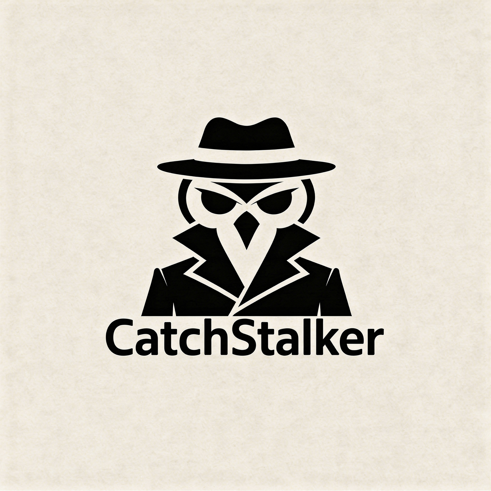

# CatchStalker

<p align="center">
  
</p>

A native macOS self-surveillance and activity monitoring application. Track your own computer usage patterns, capture periodic screenshots and camera photos, and prevent system sleep - all stored locally on your device.

## Features

### Monitoring Modules

**Keystroke Logger**
- Records all keystrokes with key codes and characters
- Captures modifier keys (Command, Control, Option, Shift, Caps Lock)
- Logs the active application context for each keystroke

**Mouse Tracker**
- Tracks mouse movements and position coordinates
- Records clicks (left, right, middle buttons) with click counts
- Monitors scroll and drag events
- Captures active application context

**Screenshot Capture**
- Periodic automatic screenshots at configurable intervals
- Multi-display support - captures all connected displays
- Uses ScreenCaptureKit on macOS 14+ with CGDisplay fallback for older versions
- Records active application at capture time

**Camera Capture**
- Periodic webcam photo capture at configurable intervals
- Records device name and image dimensions
- Automatic storage management

**App History Tracker**
- Tracks application activations and deactivations
- Records app launches and terminations
- Calculates usage duration per application
- Captures window titles

**File Access Monitor**
- Monitors file system events in configurable paths
- Tracks file creation, modification, deletion, and renaming
- Records which application performed the file operation

**Clipboard Monitor**
- Logs clipboard content changes
- Supports multiple content types: text, image, file, RTF, HTML
- Records source application and data size

### Anti-Sleep

Prevent your Mac from sleeping with flexible options:

- **Manual Toggle**: Enable/disable with a single click
- **Duration Options**: 5 minutes, 15 minutes, 30 minutes, 1 hour, 2 hours, 4 hours, 8 hours, or indefinitely
- **Schedule-based Rules**: Configure specific time windows and days of the week
- **App-based Rules**: Automatically prevent sleep when specific applications are active

### Additional Features

- **Dashboard**: View statistics and summaries of all monitored activities with interactive charts
- **Log Viewer**: Browse and search through recorded events with filtering
- **Data Export**: Export logs to JSON or CSV format
- **Auto-Cleanup**: Automatically delete old data after configurable number of days
- **Manual Cleanup**: One-click cleanup with confirmation dialog to delete all stored data
- **Password Protection**: Optional password to protect access to the application
- **Launch at Login**: Start CatchStalker automatically when you log in

## Requirements

- macOS 14.0 or later (Sonoma+)
- Xcode 15.0 or later for building
- The following system permissions:

| Permission | Required For |
|------------|--------------|
| Accessibility | Keystroke logging, Mouse tracking |
| Screen Recording | Screenshot capture |
| Camera | Camera capture |

The application will guide you through granting these permissions on first launch.

## Installation

1. Clone or download the repository
2. Open `CatchStalker.xcodeproj` in Xcode
3. Build and run the project (Command + R)
4. Grant the required permissions when prompted

To install the built application:
1. Archive the project in Xcode (Product > Archive)
2. Export the application
3. Move `CatchStalker.app` to your Applications folder

## Usage

CatchStalker runs as a menu bar application. Click the eye icon in the menu bar to access:

- **Quick Toggles**: Enable/disable individual monitoring modules
- **Anti-Sleep Controls**: Toggle sleep prevention with duration selection
- **Open Dashboard**: Access the full application window

### Main Window

The main window provides access to:

- **Dashboard**: Overview of activity statistics
- **Logs**: Detailed view of all recorded events
- **Settings**: Configure intervals, storage paths, auto-cleanup, and more
- **Permissions**: Check and manage system permission status

### Data Storage

All data is stored locally in:
```
~/Library/Application Support/CatchStalker/
├── catchstalker.db    # SQLite database
├── screenshots/       # Screenshot images
└── camera/           # Camera capture images
```

## Tech Stack

- **Language**: Swift
- **UI Framework**: SwiftUI
- **Database**: SQLite3 (native, no external dependencies)
- **Screenshot**: ScreenCaptureKit / CGDisplay
- **Camera**: AVFoundation
- **Anti-Sleep**: IOKit power assertions
- **Input Monitoring**: CGEvent / Carbon

No external dependencies or package managers required.

## Project Structure

```
CatchStalker/
├── App/
│   ├── AppDelegate.swift          # Menu bar setup, service lifecycle
│   └── CatchStalkerApp.swift      # App entry point
├── Core/
│   ├── Database/
│   │   └── DatabaseManager.swift  # SQLite operations
│   ├── Permissions/
│   │   └── PermissionsManager.swift
│   └── Settings/
│       ├── SettingsManager.swift
│       ├── ExportService.swift
│       ├── CleanupService.swift
│       ├── PasswordManager.swift
│       └── LaunchAtLoginManager.swift
├── Modules/
│   ├── Keystroke/KeystrokeLogger.swift
│   ├── Mouse/MouseTracker.swift
│   ├── Screenshot/ScreenshotCapture.swift
│   ├── Camera/CameraCapture.swift
│   ├── AppHistory/AppHistoryTracker.swift
│   ├── FileAccess/FileAccessMonitor.swift
│   ├── Clipboard/ClipboardMonitor.swift
│   └── AntiSleep/AntiSleepManager.swift
├── UI/
│   ├── MenuBar/MenuBarView.swift
│   └── MainWindow/
│       ├── MainWindowView.swift
│       ├── Dashboard/DashboardView.swift
│       ├── Logs/LogsView.swift
│       ├── Settings/SettingsView.swift
│       └── Permissions/PermissionsView.swift
├── Models.swift                    # Data models
└── Resources/
    └── Assets.xcassets
```

## Privacy Notice

CatchStalker is designed for self-surveillance purposes only. All data is stored locally on your device and is never transmitted externally. Use responsibly and in accordance with applicable laws and regulations.

## Contributing

Contributions are welcome! Please read [CONTRIBUTING.md](CONTRIBUTING.md) for guidelines.

## License

This project is licensed under the MIT License - see the [LICENSE](LICENSE) file for details.

## Changelog

### v1.1.0 (2026-01-14)
- **Dashboard Improvements**:
  - Added confirmation dialog for "Clean Up Now" button to prevent accidental data deletion
  - Improved Storage Usage card UI with better formatting and alignment
  - Storage card now spans full width consistently with other sections
- **UI/UX Enhancements**:
  - Fixed content overlapping header when scrolling in main window
  - Added modern unified toolbar style with transparent titlebar
  - Disabled "Clean Up Now" button when storage is empty
- **Requirements**:
  - Updated minimum macOS requirement to 14.0 (Sonoma)

### v1.0.0
- Initial release
- Keystroke logging with modifier key support
- Mouse tracking (movements, clicks, scrolls, drags)
- Periodic screenshot capture with multi-display support
- Camera capture at configurable intervals
- Application history tracking
- File access monitoring
- Clipboard content logging
- Anti-sleep functionality with schedules and app rules
- Dashboard with activity statistics
- Log viewer with search and filtering
- Data export (JSON/CSV)
- Auto-cleanup and manual cleanup options
- Password protection
- Launch at login support
